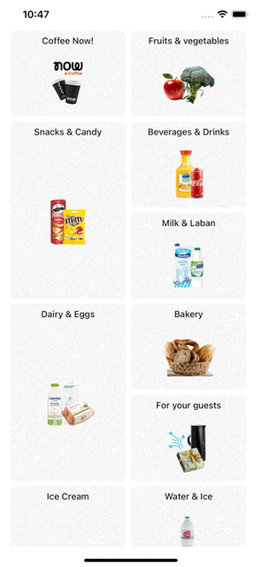
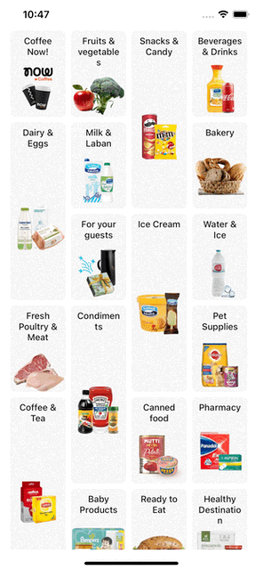

### Would you like to support me?

<div align="center">
<a href="https://github.com/nomi9995?tab=followers">
    
</a>
</br>
<a href="https://www.buymeacoffee.com/numan.dev" target="_blank"></a>
</div>

# react-native-masonry-grid

Customizable masonry Flatlist. it just behave like [Flatlist](https://reactnative.dev/docs/flatlist) but using [ScrollView](https://reactnative.dev/docs/scrollview) behind the scene

## Installation

```sh
npm install react-native-masonry-grid
```

## Preview

|  |  |  |
| :---------------------: | :---------------------: | :---------------------: |
|        2-columns        |        3-columns        |        4-columns        |

## Usage

```js
import MasonryFlatlist from 'react-native-masonry-grid';

// ...
const DATA = [
  {
    name: 'Coffee Now!',
    url: 'https://mp-staging-ix.onshobbak.net/media/ninja-catalog-42/eac92236-0e4f-466a-9bc2-e68a04bb96ad_NowCoffeeNew.png',
    height: 136, // Mendatory and can be dynamic for each item
  }
]

<MasonryFlatlist
    data={DATA}
    numColumns={3} // for number of columns
    columnWrapperStyle={styles.columnWrapperStyle}
    showsVerticalScrollIndicator={false}
    style={styles.masonryFlatlist}
    renderItem={({ item, index }) => {
      return <Card data={item} height={item.height} onPress={() => {}} />;
    }}
  />
```

## Props

```
interface Props extends ScrollViewProps {
  numColumns?: number;
  loading?: boolean;
  LoadingView?: React.ReactNode | React.ReactElement | null;

  columnWrapperStyle: StyleProp<ViewStyle>;
  ListHeaderComponent?: React.ReactNode | React.ReactElement | null;
  ListEmptyComponent?: typeof React.Fragment | React.ReactElement | null;
  ListFooterComponent?: React.ReactNode | React.ReactElement | null;
  ListHeaderComponentStyle?: StyleProp<ViewStyle>;
  contentContainerStyle?: StyleProp<ViewStyle>;
  containerStyle?: StyleProp<ViewStyle>;
  onRefresh?: RefreshControlProps['onRefresh'];
  onEndReached?: () => void;
  keyExtractor?: ((item: any, index: number) => string) | undefined;
  onEndReachedThreshold?: number;
  style?: StyleProp<ViewStyle>;
  data: any[];
  renderItem: ({ item, index }: { item: any; index: number }) => ReactElement;

}
```

| name               | required | default | description                                                                            |
| ------------------ | -------- | ------- | -------------------------------------------------------------------------------------- |
| numColumns         | no       | 2       | Number of columns you want to render.                                                  |
| columnWrapperStyle | no       | null    | Optional custom style for multi-item rows generated when `numColumns > 1`.             |
| loading            | no       | false   | for enabling loadingView.                                                              |
| LoadingView        | no       | null    | Loader component will be show when loading prop will true.                             |
| ref                | no       | null    | it will be forwardRef to `ScrollView` then you can use all props of scrollview by ref. |

**Note:** Other props are the same as [Flatlist](https://reactnative.dev/docs/flatlist). you can read flatlist docs for other props which are in props but not in the props table.

## Contributing

See the [contributing guide](CONTRIBUTING.md) to learn how to contribute to the repository and the development workflow.

## License

MIT
